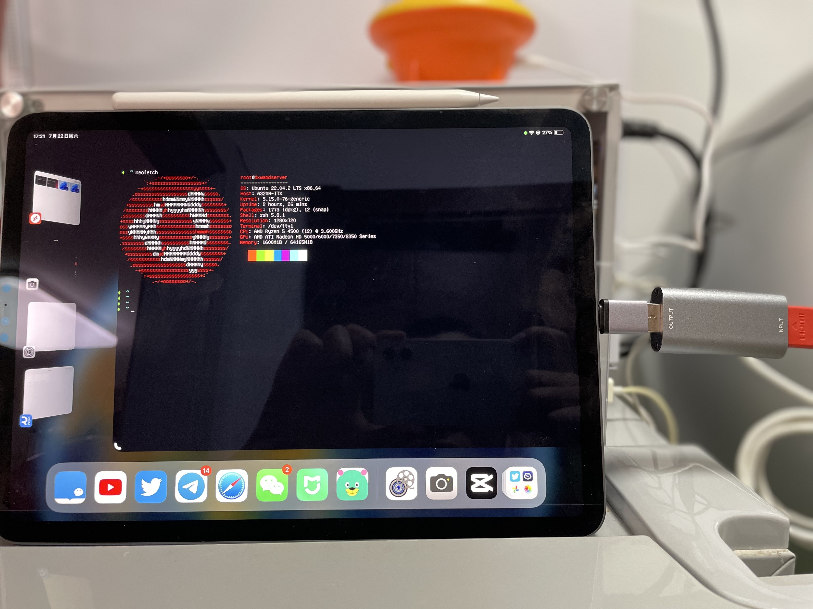

# iOS As Display

iPad serving as a display for any device (HDMI output , no software installation required).

iPadOS 17 supports external USB cameras. With the addition of a video capture card, it can be used as a temporary display for Nas, cameras, and Switch.

#### 中文：
iPad 作为任何HDMI设备的显示器（设备无需安装任何软件）

iPadOS 17 起支持外部 USB 摄像头。加上视频捕获卡，它可以临时作为 Nas、相机和 Switch 的显示器使用。

## Requests：

* iPad ( >= iPadOS 17.0 )
* Video Capture Card ( about $15 USD)
* Xcode ( >= 15.0 )